# Design and Architecture of _Chirp!_

## Domain model

<!-- image of Domain Model UML -->


The illustration above depicts our domain model of Chirp.Core, Chirp.Infrastructure and Chirp.Web. Zoom in for a better view.


## Architecture — In the small

The different layers of the Onion architecture represent the projects in the solution and what each of them know e.g. the innermost layer Chirp.Core doesn’t know the other layers/projects and the outermost layer Chirp.Web knows all the inner layers/projects.  

<!-- onion image -->
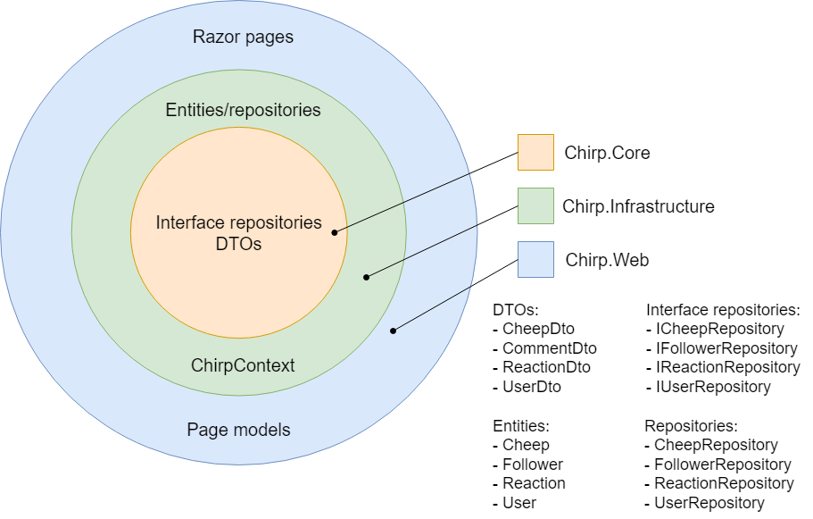


## Architecture of deployed application

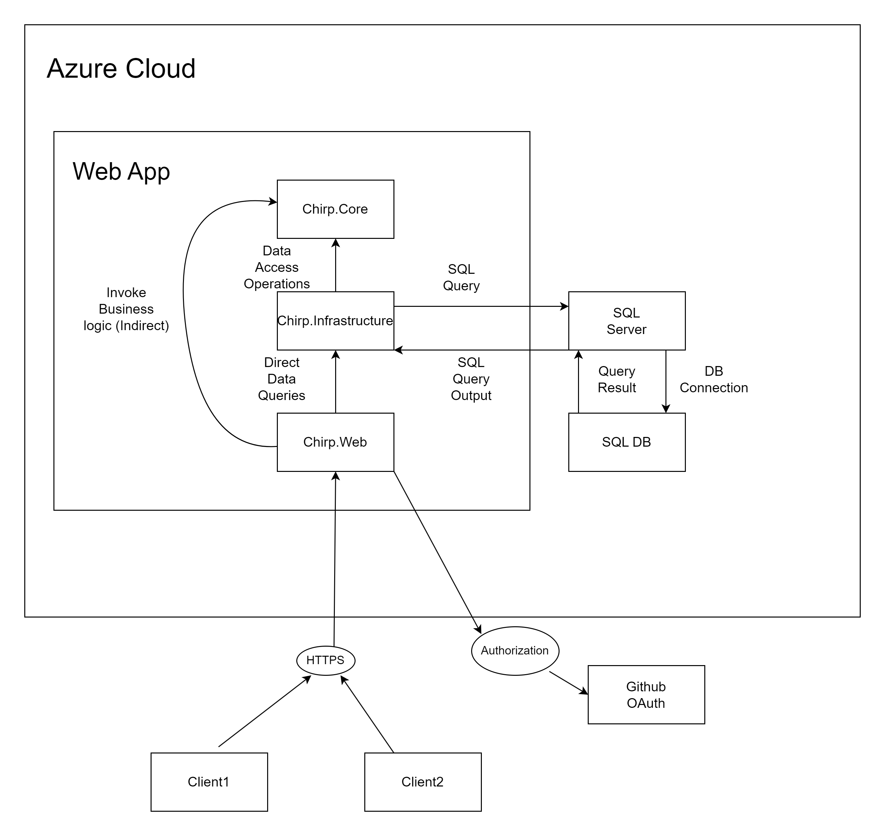


## User activities

The user activity diagram below shows all possible journeys a user can take. From the starting/entry point, each subset of a path that the user is taking, by following the arrows, is his/her user journey.

<!-- image of user activity - general -->
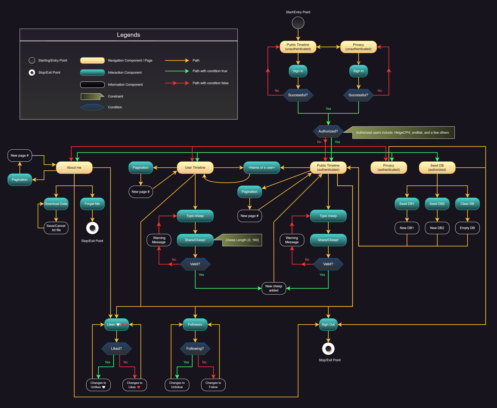

One thing that is not shown in the diagram above is that you can from any page also navigate to another page directly, either by clicking on the navigation menu (if it exists) or manually input its endpoints (or use the hidden shortcuts, alt+1 to 5). 

If an unauthenticated user tries to access a page that requires to be authenticated, you will be redirected to the GitHub login site instead, or it will log you in if you have your user information stored in the cookies.

An unauthorized user does not have the Seed DB menu on the page, but you can still try to access the authorized page (Seed DB) via the endpoint or using the shortcut.  

Both unauthorized and authorized can actually go into the Seed DB page, however the content displayed in that page is different depending on the authorization.

<!-- image of unauthorized Seed DB page -->
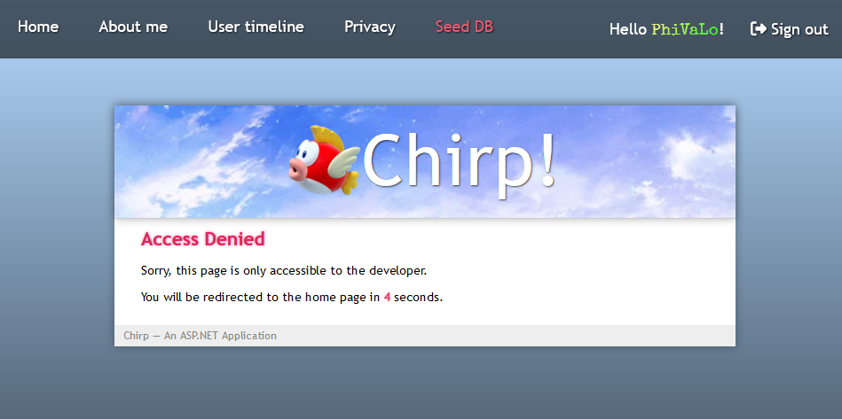

<!-- image of authorized Seed DB page -->
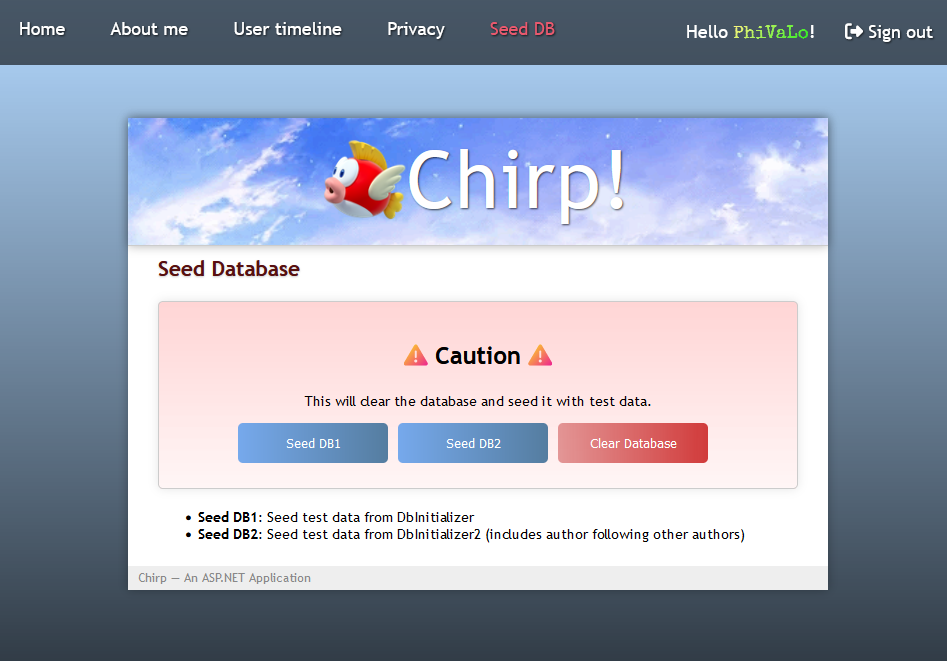


Below is a full user journey to the implmentation of our UI-test (UI testing is described later).

<!-- image of user activity - UI Testing -->
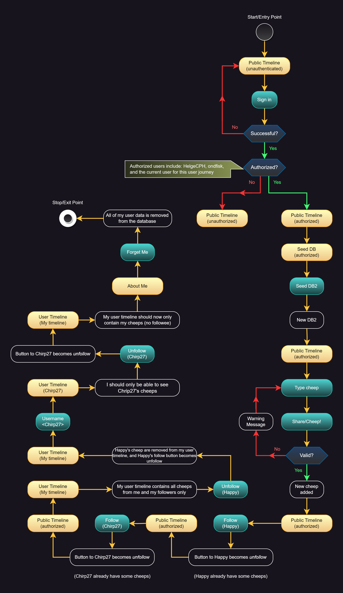


## Sequence of functionality/calls through _Chirp!_

<!-- image of Sequence diagram -->
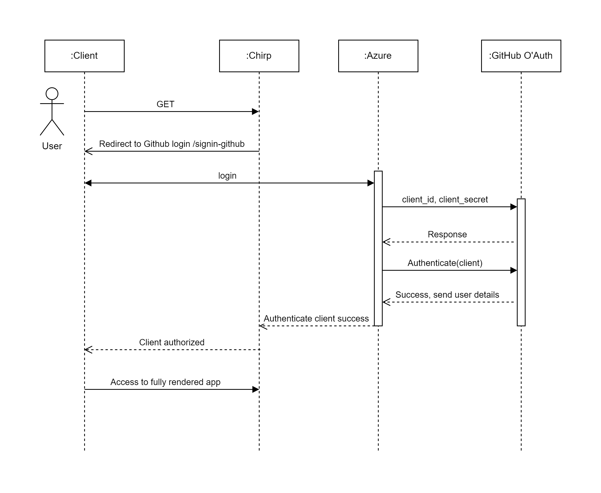


# Process

## Build, test, release, and deployment

A new pull request is created when a branch needs to be merged into the master branch. When a pull request is created, two GitHub Actions workflows get started/triggered: ‘CodeQL’ and ‘.NET (build and test)’, where the ‘CodeQL’ checks three times (CodeQL, Analyze (javascript) and Analyze (csharp)) and ‘.NET’ workflow checks twice for push and pull request.

The pull request gets merged into the master branch when all checks succeeds. Two other workflows get triggered by the merge from the pull request. The ‘Publish’ workflow makes one check and is responsible for publishing a release with a given tag. The ‘Build and deploy ASP.Net Core app to Azure Web App’ workflow makes two checks for both building and deploying and is responsible for deploying the application into Azure.

<!-- image of UML activity diagram - Build, test, release, and deployment -->
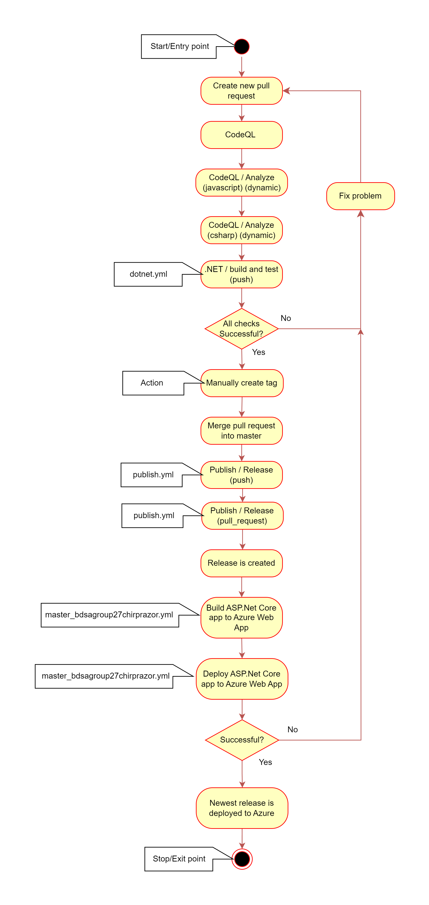


## Team work

### Project Board

<!-- image of project board with issues -->
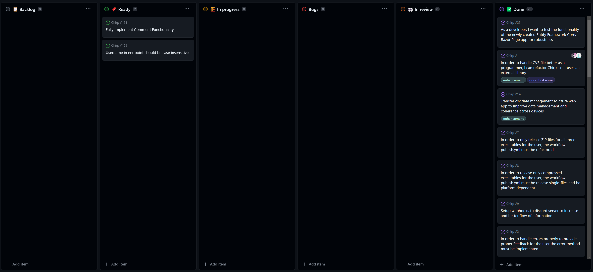

We have one unresolved functionality which is the comment feature. As of right now the feature is implemented in the code but not utilized by the front-end. That is the field for typing in a comment, the send button as well as showing the other comments on the individual cheeps.


### Flow of Activities

<!-- image of the flow of activities -->
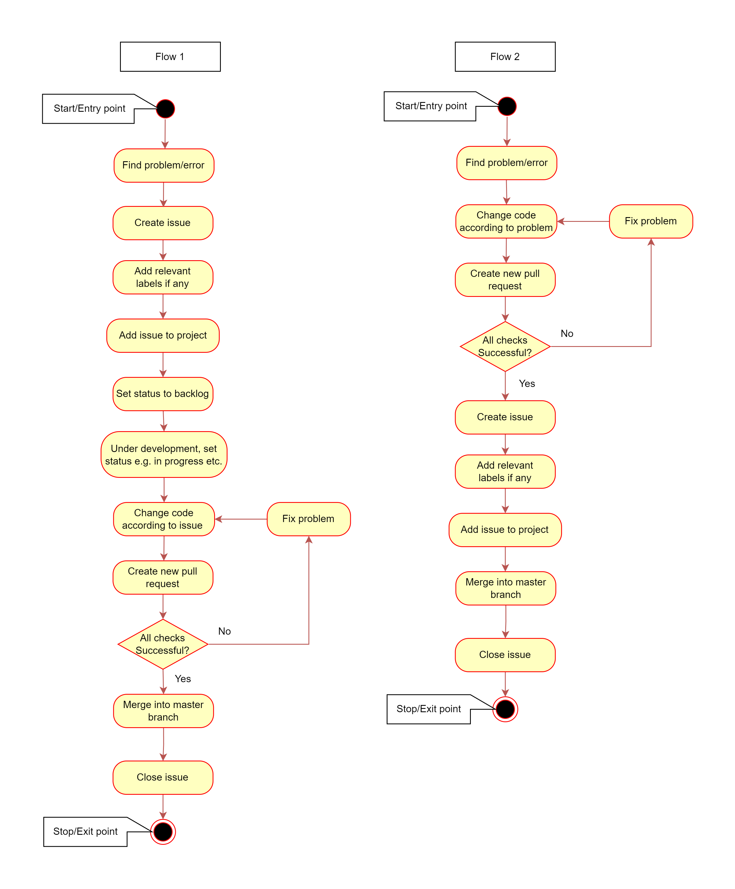

Our activity flow was a bit mixed and thereby consisted of two different flows which changed throughout development of the project/application:

Flow 1:

1. The issue/problem is found
2. The issue is noted in GitHub issues with corresponding acceptance criteria
3. Afterwards the issue is fixed according to the listed acceptance criteria on an individual branch
4. Lastly the branch with the fixed is merged into master through a pull request pending review of the other group members.

Flow 2:

1. The issue/problem is found
2. The issue is fixed through various means depending on the issue on an individual branch
3. Afterwards the issue is noted in GitHub issues with acceptance criteria matching the implemented fix (minor issues are fixed right away without making a new issue on GitHub)
4. Lastly the branch with the fixed is merged into master through a pull request pending review of the other group members.


## How to make _Chirp!_ work locally

Here is a step-by-step guide on opening our Chirp application:

1. Firstly open a terminal window and navigate to where you want the project located

2. Then clone the project down with the following command:
```bash
git clone https://github.com/ITU-BDSA23-GROUP27/Chirp.git
```

3. For the application to work, Docker is needed along with a package which is downloaded through this command:
```bash
docker pull mcr.microsoft.com/mssql/server:2022-latest
```

4. Afterwards the Docker server needs to be initialized:
```bash
docker run -e "ACCEPT_EULA=Y" -e "MSSQL_SA_PASSWORD=YourNewStrong@Passw0rd" -p 1433:1433  --name sql1 --hostname sql1 -d mcr.microsoft.com/mssql/server:2022-latest
```

5. The application requires a client id and a client secret to a GitHub OAuth which needs to be set with the following commands; replace `<GitHub clientid>` and `<GitHub client secret>` with their respective values:

```bash
dotnet user-secrets set "authentication_github_clientId" "<GitHub clientid>" --project .\Chirp\src\Chirp.Web

dotnet user-secrets set "authentication_github_clientSecret" "<GitHub client secret>" --project .\Chirp\src\Chirp.Web
```

6. From here the application can be simply launched with the following command:
```bash
dotnet run --project .\Chirp\src\Chirp.Web
```


## How to run test suite locally

### Unit/Integration tests

In this category, there are two test repositories:

* Chirp.Infrastructure.Test: is testing the repositories and their methods in different scenarios.

* Chirp.Web.Test: is testing the different methods used in the page models, meaning the functionality of the web application.

Here is a step-by-step guide on how to run test suite locally:

NOTE: If you have already cloned the project down skip to step 3. The tests will not run correctly if the application is running simultaneously.

1. Firstly open a terminal window and navigate to where you want the project located

2. Then clone the project down with the following command:
```bash
git clone https://github.com/ITU-BDSA23-GROUP27/Chirp.git
```

3. From here the test can be simply launched with the following command: 
```bash
dotnet test .\Chirp
```


### UI Testing

The UI test utilizes the Playwright library.  The following command:
```bash
dotnet build pwsh bin/Debug/net7.0/playwright.ps1 install
```

It installs various browsers and tools to run UI tests.

This test will only work locally, so it requires that you have the app running in localhost.

In order for Playwright to log you in with your GitHub account, you also need to do either of these two things:

1. Environment variables for EMAIL and PASSWORD have to be set in your environment system that matches your GitHub email and password respectively.

2. Replace the field email and password values with your actual user information (which is fine as you will not share the code) in the file `test\PlaywrightTests\UnitTest1.cs`, line 19-20.

Then in the directory `test\PlaywrightTests\`, run `dotnet test` in the terminal, and that’s it.

Note: A few scenarios can occur when trying to authenticate with GitHub:

1. When playwright clicks `Sign in` from the homepage’s navigation bar, the following GitHub authentication site should appear.

<!-- image of GitHub authorization page -->
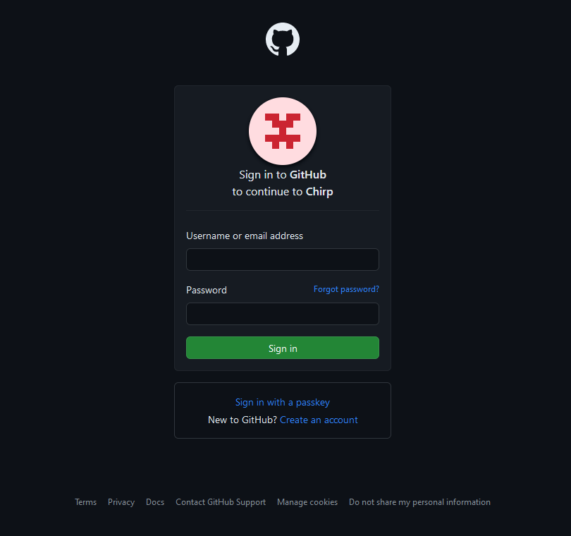

Playwright will automatically fill in the information and sign in - if successful, it will redirect you to the homepage and continue doing the rest, otherwise the test will fail if the authentication is rejected.


2. In case you have made too many GitHub request, the reauthorization page may appear instead.

<!-- image of GitHub reauthorization page -->
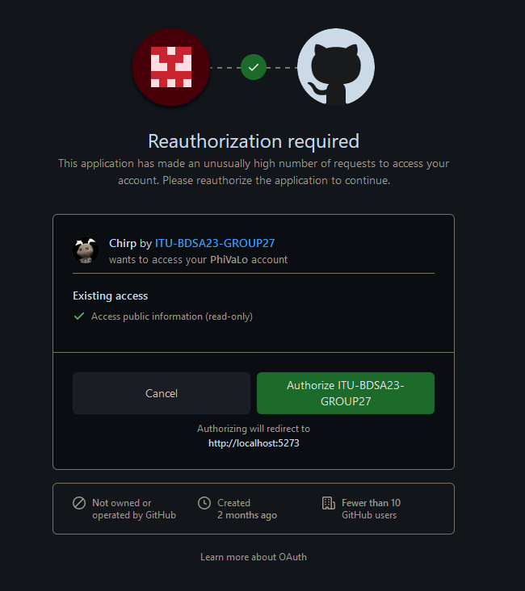

In that case, you will have to manually click the authorize button.

3. Upon signing in, there might be a situation where you will be asked to authenticate via the mobile GitHub Authentication app. This shouldn’t happen by default, but it could still happen as we have encountered it before. Then you will have to authorize it yourself from the phone (if the timer runs out on the UI test while trying to authenticate from your phone, you could increase the timer in UnitTest1.cs line 77 (currently set to 4 seconds)).

In most cases, the first situation will occur where you are not required to do more other than running the test after configuring your login.


# Ethics

## License

We chose the software license MIT which only requires the preservation of copyright and license notices. This license was chosen to put as few restrictions on the code as possible, which would allow others to use our code freely in any project/work seen fit.

### ChatGPT
ChatGPT was used throughout the development of the application whenever there was a specific scenario which we were not able to fix ourselves. This is also noted in the code with something similar to: “This was made with the help of ChatGPT”. We have used ChatGPT for trivial things such as generating a fitting paragraph for our Privacy page. Other than that, we have used ChatGPT to ask questions when we were in doubt and needed a quick answer.

### CoPilot
CoPilot was used as well in the development but more as a word/sentence completer rather than an AI helper. It was especially useful when making tests, since it was able to detect the structure of the other tests and base its answers accordingly. Because of that, creating tests of the different methods in the repositories was quite fast. At some points, CoPilot has been good at suggesting code that could guide us to the correct solution, or suggesting code that we needed. However most of the times, it generated code that we couldn't use and these moments made CoPilot not that useful.  

### Qodana
Qodana was used to check the quality of our code. It was able to detect multiple minor issues that we were not aware of, such as unused variables, unused methods, and unused namespaces. It also detected some issues with the code that we were able to fix. However, it also detected some issues that we were not able to fix, such as the use of `var` instead of the actual type. We were not able to fix this issue because it would require us to change the type of the variable, which would then require us to change the type of the variable in all the other places where it is used. This would be a lot of work and we did not see the benefit of doing it.


# Authentication
<!-- You will have to document in your project why you chose what you did and discuss pros and cons -->
The pros and cons of using GitHub OAuth with Identity and AAD B2C with Identity are discussed below.

## GitHub OAuth with Identity

Pros:

1. **Simplicity**: Setting up GitHub OAuth is very simple. You only need to create a GitHub OAuth application and add the client id and client secret to the application. You don't need to set up a database or anything else.

2. **Documentation**: GitHub provides clear and extensive documentation for OAuth and integrating it with ASP.NET Identity is also well documented. This makes it easy to set up and use.

3. **Community Support**: Since GitHub OAuth is widely used, there is a lot of community support available. If you run into any problems, you can easily find a solution online.


Cons:

1. **Limited to GitHub Users**: The main limitation is that only users with GitHub accounts can use the application. If your target audience includes users who don't use GitHub, this may be a drawback.

2. **Limited Features**: GitHub OAuth only provides basic authentication features. If you need more advanced features, you will have to implement them yourself.

3. **Dependence on GitHub's Servers**: Since GitHub OAuth depends on GitHub's servers, if GitHub's servers go down, your application will also go down.


## Azure Active Directory B2C with Identity

Pros: 

1. **Identity Provider Flexibility**: B2C supports many identity providers, including GitHub, Google, Facebook, Microsoft, etc. This means that users can use their existing accounts to log in to your application.

2. **Customization and Branding**: B2C allows you to customize the login page and add your own branding. This allows you to create a consistent user experience across all your applications.

3. **Scalability and Enterprise Features**: B2C is designed for enterprise applications, so it has many features that are useful for enterprise applications, such as multi-factor authentication, single sign-on, and more.

Cons:

1. **Learning Curve**: Setting up B2C might have a steeper learning curve, especially if you are not familiar with B2C. However, once you learn how to use it, it is very easy to use.

2. **Complexity**: The additional features and flexibility of B2C can introduce complexity, making the initial setup take more time compared to a simpler solution like GitHub OAuth.


## Conclusion

GitHub OAuth with Identity was choosen for simplicity and ease of use for this mini project. It is easy to set up and use, and it provides all the features we need for _Chirp!_, and using GitHub is a functional requirement. 

In contrast, B2C might be better for this project, if _Chirp!_ one day have a large community with a lot of concurrent users, and we need to support multiple identity providers. 
